# 프로젝트

<b>프로젝트 이름</b> : 스토리 텔러  

<b>프로젝트 내용</b> : 집이 제일 좋은 사람들의 드라마 추천 페이지.

<b>기능 소개 요약</b>: youtube api 기능 및 파이어베이스를 활용하여 드라마 추천 페이지를 구성하였습니다.

<b>프로젝트 목표</b> : 핵심 기능 이해 및 마감시간 전 완성.

---

# 기술스택

Environment

   

Database

Development

     

---

# 팀원 소개

|  팀원  | MBTI |                    블로그                    |             깃허브              |
| :----: | :--: | :------------------------------------------: | :-----------------------------: |
| 김진우 | ENTP |        https://velog.io/@wlsdn090909         |  https://github.com/Kimjinwoo1  |
| 백연주 | ENFP |           hellokeitha.tistory.com            | https://github.com/hellokeitha  |
| 이서진 | ENFJ | https://blossomflower2214.tistory.com/manage | https://github.com/leeseojin221 |
| 백예나 | INFP |     https://blog.naver.com/driarydiary12     |   https://github.com/whybwhyd   |

---

# 페이지 소개

1. Main 페이지: 장르 카테고리 별 드라마를 카드 형식으로 추천합니다.   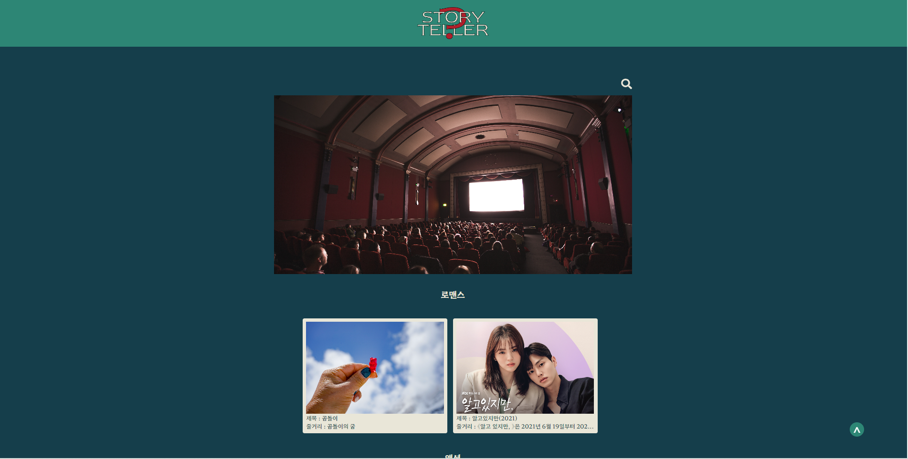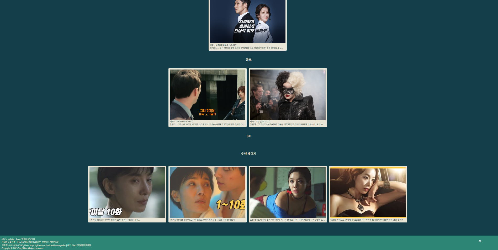  

2. Search 페이지: 카테고리 별로 드라마를 확인할 수 있으며 결과가 없을 때 추천 목록이 뜹니다.  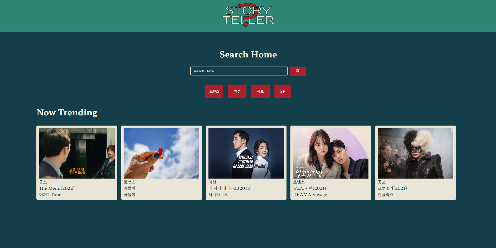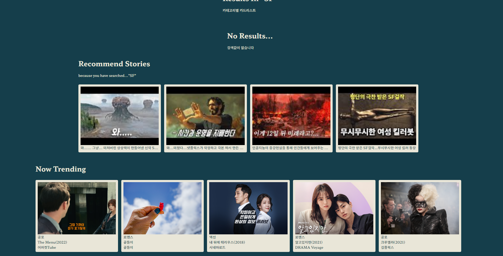 

3. Detail 페이지: 카드를 누르면 드라마 세부 내용을 확인할 수 있습니다.  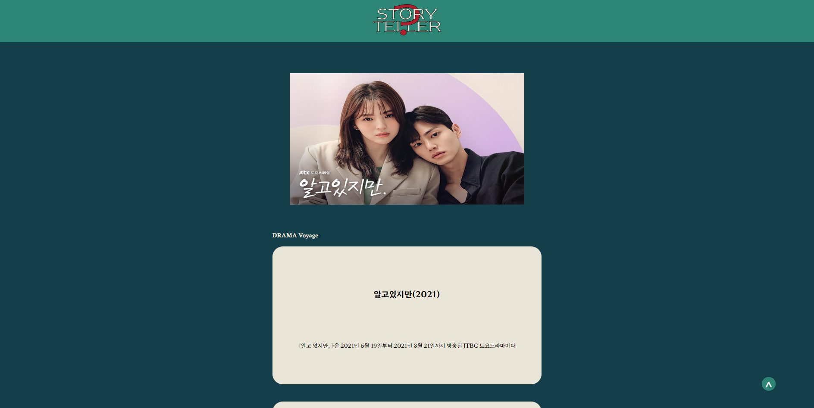 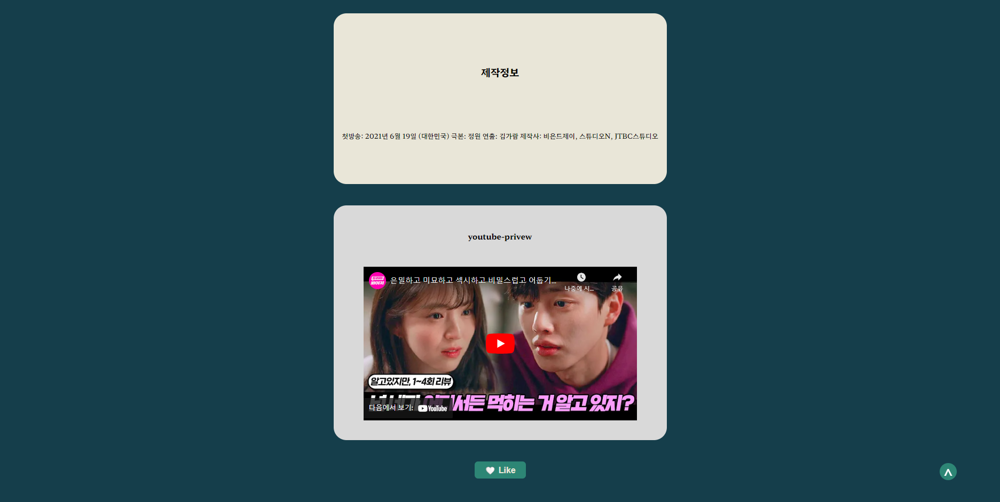 

4. About 페이지: 페이지 소개 페이지입니다.  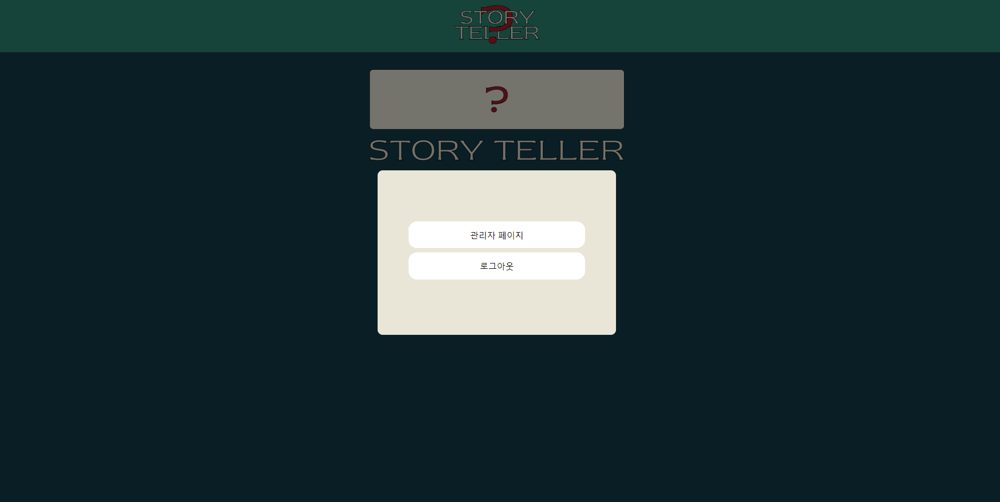 

5. Admin 페이지: 글 목록 확인 및 작성이 가능합니다. 로그인을 해야 글 작성 및 수정이 가능합니다.  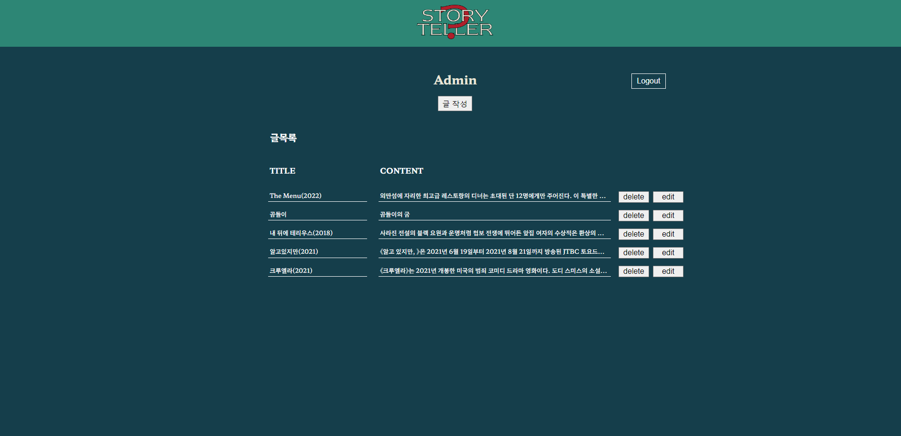 

6. Write 페이지: 에디터가 글을 작성할 수 있는 페이지입니다.  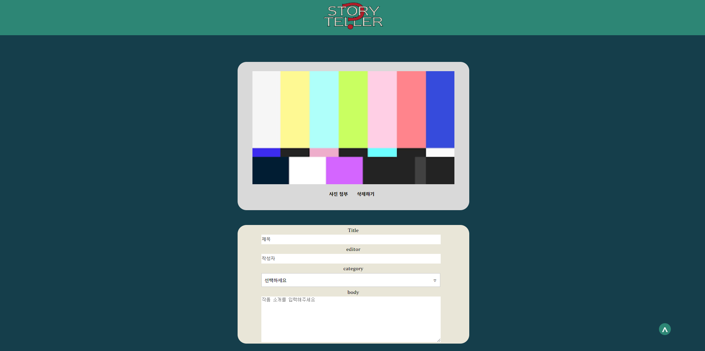 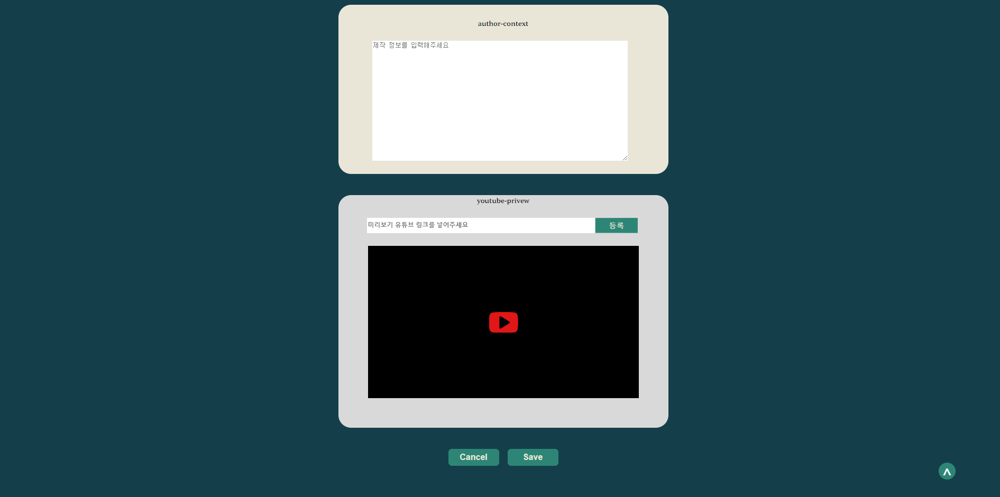 

7. Edit 페이지: 드라마 별 내용을 수정할 수 있습니다. 수정 전 내용도 확인 가능합니다.  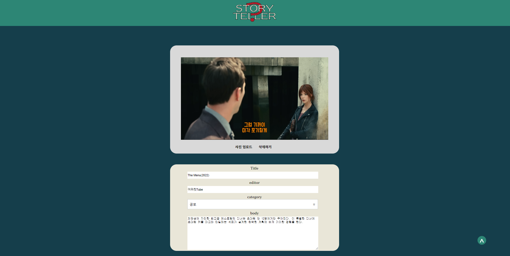 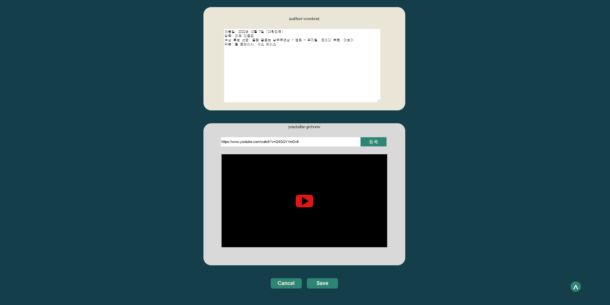
